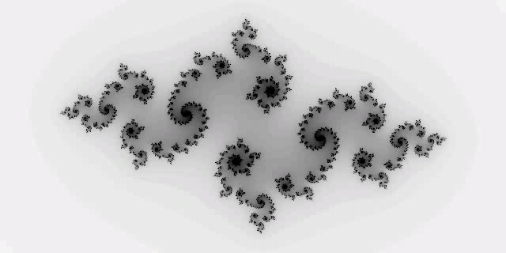

# Introduction

This repository is mainly about basic physical simulation, such as mass-spring system, SPH, MPM and so on.This is also my learning record of GAMES201.

<h4 align=center>Julia Fractal</h4>

<h4 align=center>Cloth Simulation</h4>

